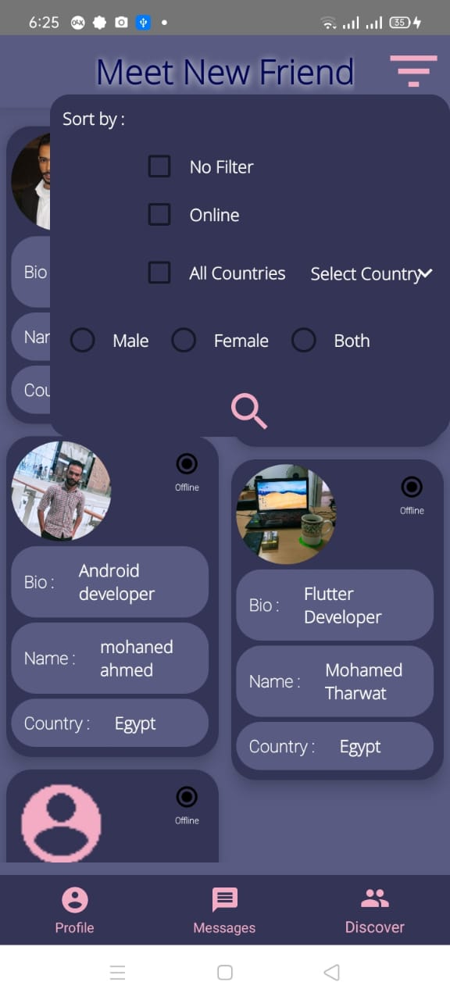

# Q-Chat
# MVP - Firebase (Real-time, Cloud Messaging, Firebase Storage)
# Description: 
     • Chatting Application that gives you the ability to matching with new people from your country based on your Location.
     • Chatting with new people from different countries.
     • Meet new people from all over the world and also can filtered user by (location or online users or based on gender of user).
# Technologies in development:
    • MVP Architecture Pattern.
    • Firebase (Authentication, Real-time Database, Cloud Messaging and File Storage). 
    • Butter Knife.
    • Glide.
    • Views (Tabbed Activity, Recycle View, Card View …).

# Screen-Shots:

